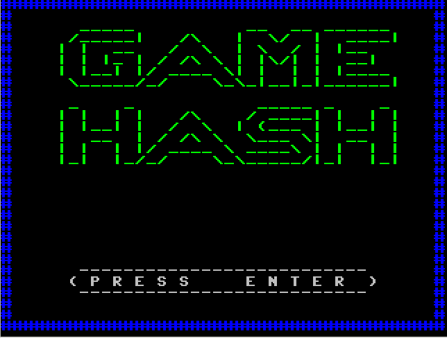
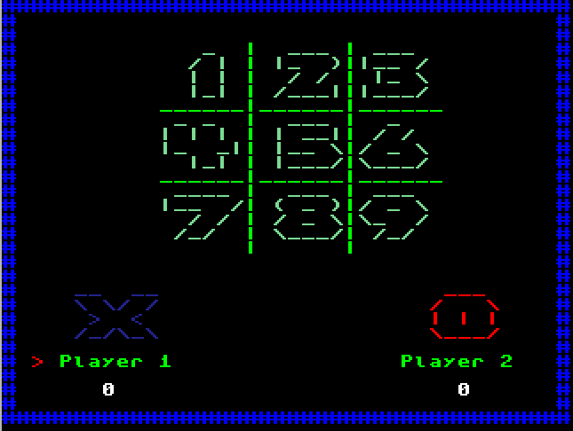
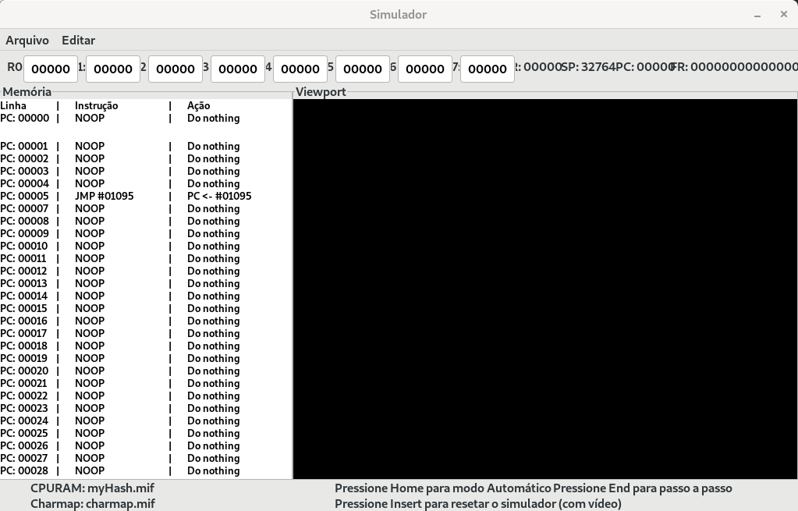

# GAME MY HASH!

Este é um projeto desenvolvido por Ueslei Pina, Nicolas de Góes e João Pedro,
alunos de Sistemas de Informação na Usp — São Carlos, para a disciplina SSC0511-Organização-de-Computadores-Digitais
ministra pelo digníssimo prof° Eduardo do Valle Simões.

 

## Instalando o Simulador:

### Instale o GTK: 

    sudo apt-get install libgtk2.0-dev    

## Para compilar o simulador: 
Vá na pasta que contém os arquivos do simulador: "simulador_fonte"

### Para compilar:
    sh compila.sh

Ignore os Warning's!
Confira se tem direito de execução [x] :

## Instalando o Montador:
Vá na pasta que contém os arquivos do montador: "montador_fonte"

### Para compilar: 
    gcc *.c -o montador

### Confira se tem direito de execução:

Para mostra as permissões:

    ls -l  montador

Caso não haja permissão [x] :

    sudo chmod +x /montador

# Play Game!
Vá para a pasta raiz

### Para montar o código: 
    ./montador_fonte/montador myHash.asm myHash.mif

### Para executar o simulador
    ./simulador_fonte/sim myHash.mif charmap.mif

### Use Makefile como alternativa para Play Game:

    make

## Jogando
> Pressione a tecla _"Home"_ para que o simulador execute no modo automático.

>Escolha com quantas vitórias o jogo termina. 

> Utilize as teclas de _1_ a _9_ para escolher onde será posto _X_ ou _O_ conforme a vez do jogador.

> Se divirta!!!
> 
## Para desinstalar o GTK:

    sudo apt autoremove
